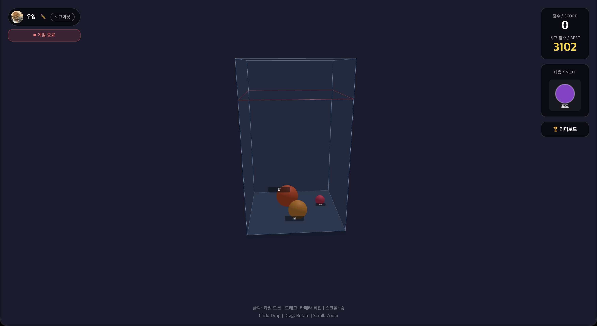
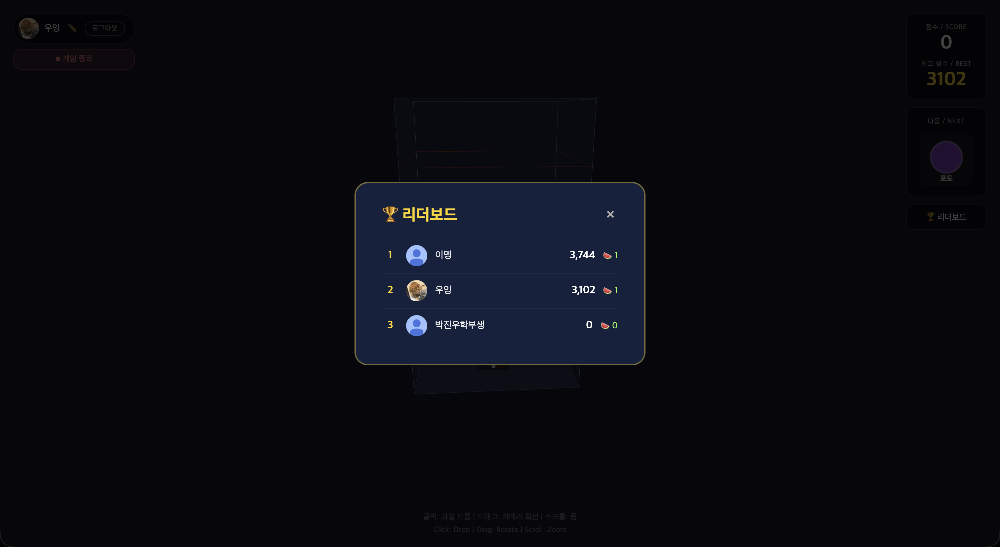

# 🍉 3D 수박게임

> 3D 공간에서 즐기는 과일 합체 퍼즐 게임

[](https://threed-game-cg.onrender.com)


---

## 🎮 게임 소개

같은 종류의 과일을 합체시켜 더 큰 과일로 만드는 3D 퍼즐 게임입니다.  
체리에서 시작해 수박까지, 얼마나 많은 과일을 합체할 수 있을까요?

**과일 합체 순서**

```
🍒 체리  →  🍓 딸기  →  🍇 포도  →  🍊 귤  →  🫐 감
→  🍎 사과  →  🍐 배  →  🍑 복숭아  →  🍍 파인애플  →  🍈 멜론  →  🍉 수박
```

---

## ✨ 주요 기능

| 기능 | 설명 |
|------|------|
| 🌐 **3D 물리 엔진** | cannon-es 기반의 실제 물리 시뮬레이션 |
| 🎯 **직관적인 조작** | 클릭 또는 스페이스바로 과일 드롭, 드래그로 카메라 회전 |
| 🔐 **구글 로그인** | Google OAuth 2.0 소셜 로그인 |
| 🏆 **글로벌 리더보드** | 전 세계 유저와 점수 경쟁 (동점 시 수박 수 · 달성 시간 기준) |
| 🍉 **수박 누적 카운터** | 게임별 수박 수 + 유저 누적 수박 수 저장 및 표시 |
| 🎨 **닉네임 설정** | 리더보드에 표시될 닉네임 커스텀 |
| 📐 **분할 뷰** | 탑다운(좌) + 원근(우) 동시 화면 지원 |
| ⚙️ **설정 모달** | 사운드 볼륨, 드롭 방식, 분할 뷰 토글 |
| 💬 **피드백** | 로그인 유저 대상 인게임 피드백 전송 |
| 🔍 **종료 상태 보기** | 게임오버 후 과일 배치 그대로 자유롭게 살펴보기 |
| 🛡️ **관리자 대시보드** | 유저·점수·피드백 통계 조회 (`/admin`) |
| 🤖 **AI 자연어 명령** | 하단 입력창에 한국어로 명령 → Gemini가 게임 액션으로 변환 실행 → [상세 문서](./LLM_CONTROL.md) |

---

## 🕹️ 조작법

| 입력 | 동작 |
|------|------|
| `클릭` | 과일 드롭 (클릭 모드) |
| `스페이스바` | 과일 드롭 (스페이스 모드, 설정에서 전환) |
| `마우스 드래그` | 카메라 회전 |
| `스크롤` | 줌 인/아웃 |
| `터치` | 모바일 지원 |

---

## 📸 스크린샷

> 게임 화면, 리더보드, 닉네임 설정 UI

<table>
  <tr>
    <td align="center"><b>게임 플레이</b></td>
    <td align="center"><b>리더보드</b></td>
  </tr>
  <tr>
    <td></td>
    <td></td>
  </tr>
</table>

---

## 🛠️ 기술 스택

**Frontend**
- [Three.js](https://threejs.org/) — 3D 렌더링
- [cannon-es](https://github.com/pmndrs/cannon-es) — 물리 시뮬레이션
- [Vite](https://vitejs.dev/) — 빌드 도구

**Backend**
- [Node.js](https://nodejs.org/) + [Express](https://expressjs.com/) — API 서버
- [Neon](https://neon.tech/) — Serverless PostgreSQL
- [Google OAuth 2.0](https://developers.google.com/identity) — 소셜 로그인
- [JWT](https://jwt.io/) — 인증 토큰

**Deploy**
- [Render](https://render.com/) — 풀스택 배포

---

## 🚀 로컬 실행

### 요구사항
- Node.js 18+
- Neon 계정 (또는 PostgreSQL DB)
- Google Cloud Console OAuth 앱

### 설정

```bash
# 저장소 클론
git clone https://github.com/Losecow/3D_Game_CG.git
cd 3D_Game_CG

# 프론트엔드 패키지 설치
npm install

# 서버 패키지 설치
cd server && npm install && cd ..
```

**`server/.env` 파일 생성**

```env
DATABASE_URL=postgresql://...
GOOGLE_CLIENT_ID=your-google-client-id
JWT_SECRET=your-random-secret
FRONTEND_URL=http://localhost:5173
PORT=3001
```

**`.env` 파일 생성** (프로젝트 루트)

```env
VITE_API_URL=http://localhost:3001
```

### 실행

```bash
# 터미널 1 — 백엔드
cd server && node index.js

# 터미널 2 — 프론트엔드
npm run dev
```

브라우저에서 `http://localhost:5173` 접속

---

## 🗄️ DB 스키마

```sql
CREATE TABLE users (
  id                 SERIAL PRIMARY KEY,
  google_id          VARCHAR(255) UNIQUE NOT NULL,
  email              VARCHAR(255) NOT NULL,
  name               VARCHAR(255),
  nickname           VARCHAR(20),
  picture            VARCHAR(500),
  total_watermelons  INTEGER DEFAULT 0,
  created_at         TIMESTAMP DEFAULT NOW()
);

CREATE TABLE scores (
  id          SERIAL PRIMARY KEY,
  user_id     INTEGER REFERENCES users(id) ON DELETE CASCADE,
  score       INTEGER NOT NULL,
  watermelons INTEGER DEFAULT 0,
  created_at  TIMESTAMP DEFAULT NOW()
);

CREATE TABLE feedback (
  id         SERIAL PRIMARY KEY,
  user_id    INTEGER REFERENCES users(id) ON DELETE CASCADE,
  content    TEXT NOT NULL,
  created_at TIMESTAMP DEFAULT NOW()
);
```

---

## 📁 프로젝트 구조

```
3D_Game_CG/
├── src/
│   ├── Game.js        # 메인 게임 로직
│   ├── Fruit.js       # 과일 오브젝트
│   ├── Merger.js      # 합체 처리
│   ├── Container.js   # 게임 컨테이너
│   ├── World.js       # 물리 세계
│   ├── UI.js          # UI 관리
│   ├── Auth.js        # 인증 모듈
│   ├── Settings.js    # 설정 모달
│   ├── Sound.js       # 사운드
│   ├── FruitData.js   # 과일 데이터 상수
│   └── admin.js       # 관리자 페이지 스크립트
├── server/
│   ├── index.js       # Express 서버
│   ├── db.js          # DB 연결 & 마이그레이션
│   ├── routes/
│   │   ├── auth.js    # 구글 로그인 API
│   │   ├── scores.js  # 점수 & 리더보드 API
│   │   ├── feedback.js # 피드백 API
│   │   └── admin.js   # 관리자 API
│   └── middleware/
│       ├── auth.js    # JWT 인증 미들웨어
│       └── adminAuth.js # 관리자 인증 미들웨어
├── public/
│   └── textures/      # 과일 & 바닥 텍스쳐
├── index.html
├── admin.html         # 관리자 페이지
├── main.js
├── style.css
├── vite.config.js
└── render.yaml        # Render 배포 설정
```

---

## 📝 업데이트 내역

### 2026.07
- AI 자연어 명령 패널 추가 — Gemini LLM으로 한국어 명령을 게임 액션으로 변환 ([상세 문서](./LLM_CONTROL.md))
- 분할 뷰 활성 시 UI 패널(점수·다음 과일)을 왼쪽 위로 이동 — 3D 뷰 가림 해소
- 레인보우 과일 스폰 확률 1% → 0.3% 조정

### 2026.06
- 레인보우 과일 추가 — 1% 확률 스폰, 어떤 과일과도 합체 시 대상 +1 레벨업, 글로우·에미시브·텍스쳐 흐르기 FX
- 커스텀 텍스쳐 — 웹캠 촬영 또는 파일 업로드로 과일 텍스쳐 교체, 3D 구체 미리보기 스텝 지원
- 상점 기능 추가 — 누적 수박으로 섞기 / 뒤집기 / 과일 삭제 / 닉네임 변경 아이템 구매
- 어드민 계정 특수 처리 — 리더보드 제외, 점수 미저장, 수박 자동 충전(9999)
- 게임오버 화면 피드백 링크 추가 (로그인 시 깜박임 효과)
- 게임오버 후 현재 상태 보기 (inspect 모드)
- 합체 발생 시 게임오버 판정 유예 / 위험선 4개 초과 즉시 게임오버
- 바구니 바닥 텍스쳐 적용 및 과일 그림자 추가
- 과일 텍스쳐 캔디 스타일로 교체, 드롭 미리보기 구체도 텍스쳐 통일
- 리더보드 수박 수 분리 표시 (게임별 / 누적) 및 동점 타이브레이커 추가
- 유저별 누적 수박 개수 DB 저장 및 게임오버 화면 표시
- 관리자 대시보드 추가 (`/admin`) — 통계·유저·점수·피드백 조회
- 피드백 기능 추가 (설정 모달 내, 로그인 전용)
- 분할 뷰 레이아웃 개편 (탑다운 좌 60% / 원근 우 40%, OrbitControls 복원)
- 설정 모달 추가 (볼륨, 드롭 방식 클릭/스페이스, 분할 뷰 토글)

### 2026.05
- 현재·다음 과일 동시 UI 표시
- 구글 로그인 / 닉네임 설정 / 리더보드 / Neon DB 연동
- 토큰 만료 시 자동 로그아웃 처리
- 과일 드롭 위치 벽 안쪽 클램핑 (반지름 기준)
- 배경 흰색으로 변경

---

## 📜 라이선스

MIT
